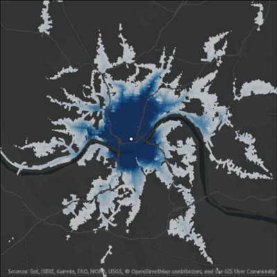
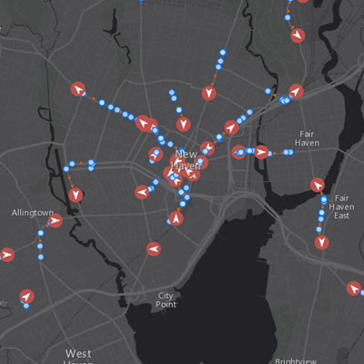

# public-transit-tools

This repo contains free, downloadable sample tools provided by Esri for analysis using public transit data in ArcGIS.  These tools are intended to extend the capabilities of Esri's core products.

### Transit Network Analysis Tools

[transit-network-analysis-tools](transit-network-analysis-tools/README.md)

The Network Analyst extension in ArcGIS includes tools for transportation analysis and routing, particularly for modeling and optimizing travel through a transportation network. You can include public transit schedule data in your transportation network in order to model travel by public transit for a variety of workflows in transportation and urban planning, public health, economic development, and so on.

Once you have created your transit-enabled network dataset using the tools provided in ArcGIS Pro, you may be interested in doing some further analysis. The Transit Network Analysis Tools (the tools right here in this repo) are a set of tools for performing transit-specific network analysis. They are intended to supplement the Network Analyst extension with functionality not available out of the box. In particular, the tools account for the time-dependent nature of public transit and assist with analyses commonly needed by those working with public transit.

- *Calculate Accessibility Matrix* solves an Origin-Destination Cost Matrix analysis incrementally over a time window and summarizes the results. It can be used to count the number of jobs accessible to a set of origins within a reasonable commute time.
- *Calculate Travel Time Statistics* calculates some simple statistics about the total transit travel time between locations over a time window and writes the output to a table.
- *Prepare Time Lapse Polygons* and *Create Percent Access Polygons* help you visualize the area reachable by transit across a time window.
- *Copy Traversed Source Features With Transit* returns the individual network segments traversed in a route enhanced with the wait time, ride time, and Run ID for each transit line used.

### GTFS Realtime Connector for GeoEvent

[send-GTFS-rt-to-GeoEvent](send-GTFS-rt-to-GeoEvent/README.md)

[GTFS Realtime](https://github.com/google/transit/tree/master/gtfs-realtime/spec/en) is an extension to static GTFS that provides a standard format for the real time status of a transit system, such as the positions of buses and trains, information about delays, and service alerts. The GTFS Realtime Connector for GeoEvent Server allows you to ingest GTFS Realtime feeds and display them in a map.

The GTFS Realtime Connector for GeoEvent Server can poll and process the three feed types listed below:
- Trip updates – delays, cancellations, updated routes, etc.
- Service alerts – stop moved, unforeseen events affecting a station, route, or the entire network, etc.
- Vehicle positions – information about transit vehicles including location and congestion level.

### Deprecated tools

[deprecated-tools](deprecated-tools/README.md)

A set of older tools for ArcMap that are no longer updated or maintained.  Please use the tools that are included in ArcGIS Pro instead.  These deprecated tools will be removed soon.

## Learning materials

Start here! [This comprehensive Story Map](https://arcg.is/1mbqyn) highlights key concepts and best practices for public transit GIS analysis. It shows how to determine who your transit system serves, how well people are served by transit, and how easy it is for people to access important destinations by transit.

When you're ready for a deep dive, watch this comprehensive tutorial video series to learn techniques and best practices for public transit analysis in ArcGIS Pro:
- [Tutorial videos](https://www.youtube.com/playlist?list=PLGZUzt4E4O2KQz9IxGKrEyKB8rA0UVx1W)
- [Slides used in tutorial videos](https://esriurl.com/TransitVideoDownloads)

Other learning resources:
- ArcGIS Pro written tutorial: [Create and use a network dataset with public transit data](https://pro.arcgis.com/en/pro-app/latest/help/analysis/networks/create-and-use-a-network-dataset-with-public-transit-data.htm)
- Learn Lesson: [Assess access to public transit](https://learn.arcgis.com/en/projects/assess-access-to-public-transit/)
- Blog posts:
  - [Use schedule-based public transit in Network Analyst with Pro 2.4](https://www.esri.com/arcgis-blog/products/arcgis-pro/analytics/public-transit-network-analyst/)
  - [Who does my public transit system serve?](https://www.esri.com/arcgis-blog/products/arcgis-online/analytics/who-does-my-public-transit-system-serve/)
  - [Map the frequency of transit service across your city and find out why it matters](https://www.esri.com/arcgis-blog/products/arcgis-pro/analytics/map-the-frequency-of-transit-service-across-your-city-and-find-out-why-it-matters/)
  - [Mapping transit accessibility to jobs](https://www.esri.com/arcgis-blog/products/product/analytics/mapping-transit-accessibility-to-jobs/)
  - [How to make a shapes.txt file for your GTFS dataset with ArcGIS](https://www.esri.com/arcgis-blog/products/arcgis-pro/analytics/how-to-make-a-shapes-txt-file-for-your-gtfs-dataset-with-arcgis/)

## Reference materials and useful links

* ArcGIS Pro documentation: [Public transit in Network Analyst](https://pro.arcgis.com/en/pro-app/latest/help/analysis/networks/network-analysis-with-public-transit-data.htm)
* ArcGIS Pro documentation: [Public Transit Tools.tbx geoprocesing toolbox](https://pro.arcgis.com/en/pro-app/latest/tool-reference/public-transit/an-overview-of-the-public-transit-toolbox.htm)
* [GTFS specification](https://github.com/google/transit/blob/master/gtfs/spec/en/reference.md)
* [GTFS Realtime](https://github.com/google/transit/tree/master/gtfs-realtime/spec/en)
* [GTFS Best Practices](https://gtfs.org/schedule/best-practices/) - Guidelines for creating a good quality GTFS feed
* [The Mobility Database](https://database.mobilitydata.org/) - Catalog of open GTFS datasets from around the world
* [Temporal variability in transit-based accessibility to supermarkets](https://www.sciencedirect.com/science/article/pii/S0143622814001283) by Steve Farber, Melinda Morang, and Michael Widener, in the Journal of Applied Geography

## Other ArcGIS tools for public transit agencies

ArcGIS has many tools, products, and solutions applicable to public transit agencies beyond the analytical tools in this repo and discussed in the learning materials above.  Learn more using the links below.

- Configurable tools and templates from the ArcGIS Solutions for Local Government's Transit Solution
  - [Rider outreach](https://doc.arcgis.com/en/arcgis-solutions/latest/reference/introduction-to-transit-outreach.htm)
  - [Adopt-a-stop program management](https://doc.arcgis.com/en/arcgis-solutions/latest/reference/introduction-to-adopt-a-stop.htm)
  - [Transit safety management](https://doc.arcgis.com/en/arcgis-solutions/latest/reference/introduction-to-transit-safety.htm)
- [Real-Time AVL Feeds With ArcGIS](https://community.esri.com/t5/public-transit-blog/real-time-avl-feeds-with-arcgis/ba-p/883008)
- [Survey123 and Webhooks for Transit](https://community.esri.com/t5/public-transit-blog/survey123-and-webhooks-for-transit/ba-p/882990)
- [Public Transit Real Estate Solution](https://community.esri.com/t5/public-transit-blog/public-transit-real-estate-solution/ba-p/883013)
- [Transit Incident Reporting](https://community.esri.com/t5/public-transit-blog/transit-incident-reporting/ba-p/882969)
- [Routing a Fleet of Vehicles with Ready-To-Use Tools](https://community.esri.com/t5/public-transit-blog/routing-a-fleet-of-vehicles-with-ready-to-use/ba-p/882993)
- [Make your static bus timetables sing and move along with Arcade](https://community.esri.com/t5/arcgis-online-blog/make-your-static-bus-timetables-sing-and-move/ba-p/890211)

## Problems or questions?

Find a bug or want to request a new feature?  Please let us know by submitting an [issue](../../issues), or post a question in the [Esri Community forums](https://community.esri.com/t5/public-transit-questions/bd-p/public-transit-questions).

## Contributing

Esri welcomes contributions from anyone and everyone. Please see our [guidelines for contributing](https://github.com/esri/contributing).

## Licensing
Copyright 2023 Esri

Licensed under the Apache License, Version 2.0 (the "License");
you may not use this file except in compliance with the License.
You may obtain a copy of the License at

   http://www.apache.org/licenses/LICENSE-2.0

Unless required by applicable law or agreed to in writing, software
distributed under the License is distributed on an "AS IS" BASIS,
WITHOUT WARRANTIES OR CONDITIONS OF ANY KIND, either express or implied.
See the License for the specific language governing permissions and
limitations under the License.

A copy of the license is available in the repository's [license.txt](License.txt?raw=true) file.
