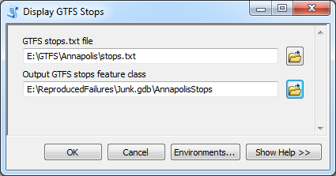
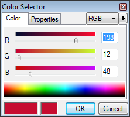

#Display GTFS in ArcGIS User's Guide

Created by Melinda Morang, Esri  
Contact: <mmorang@esri.com>

Copyright 2016 Esri  
Licensed under the Apache License, Version 2.0 (the "License"); you may not use this file except in compliance with the License.  You may obtain a copy of the License at <http://www.apache.org/licenses/LICENSE-2.0>.  Unless required by applicable law or agreed to in writing, software distributed under the License is distributed on an "AS IS" BASIS, WITHOUT WARRANTIES OR CONDITIONS OF ANY KIND, either express or implied.  See the License for the specific language governing permissions and limitations under the License.

##What this tool does
The Display GTFS in ArcGIS toolbox allows you to add GTFS transit stops and route shapes to ArcMap or ArcGIS Pro.

The [Display GTFS Stops](#Stops) tool makes a feature class of stops using information from the GTFS stops.txt file.

The [Display GTFS Route Shapes](#Shapes) tool converts the information from the GTFS routes.txt and shapes.txt files into an ArcGIS feature class, allowing you to view your transit lines on a map.  The output will contain one line feature for each unique shape in your GTFS data.  The attributes for each line contain all the information about the routes represented by the shape.

##Software requirements
- ArcGIS 10.0 or higher with a Desktop Basic (ArcView) license, or ArcGIS Pro.

##Data requirements
- A valid GTFS dataset. To use the Display GTFS Route Shapes tool, your GTFS dataset must include the optional shapes.txt file.

##Getting started
- Download the tool and save it anywhere on your computer.
- Unzip the file you downloaded.  The unzipped package contains a .tbx toolbox file, a folder of python scripts needed to run the toolbox, and a copy of this user's guide.
- No installation is necessary.  You can run the tool from ArcCatalog, ArcMap, or ArcGIS Pro.  In any of those products, just navigate to the folder containing the .tbx file, and it should show up as a toolbox with tools you can run.  You can also add the tool to ArcToolbox to make it easier to find later.
- *Warning: If you wish to move the toolbox to a different location on your computer, make sure you move the entire package (the .tbx file, the scripts folder, and the user's guide) together so that the toolbox does not become disconnected from the scripts.*

##Running *Display GTFS Stops*

###Inputs
- **GTFS stops.txt file to edit**:  The stops.txt file you wish to edit
- **Output GTFS stops feature class**:  The feature class version of your GTFS stops that will be created. *Note: a file geodatabase feature class is recommended over a shapefile because shapefiles will truncate the longer field names to 10 characters.*

###Outputs
- **[Your designated output feature class]**: This feature class will be an exact copy of your stops.txt file and will display the stop locations on the map.

##Running *Display GTFS Route Shapes*

###Inputs
- **GTFS directory**:  The *folder* containing your (unzipped) GTFS .txt files.  Your GTFS data folder must contain these files: trips.txt, routes.txt, and shapes.txt.
- **Output feature class**:  The output feature class that will contain the GTFS route shapes.

###Outputs
- **[Your designated output feature class]**: The output feature class contains all the information from the GTFS routes.txt file as well as the shape_id. Please review the [GTFS Reference](https://developers.google.com/transit/gtfs/reference) if you need help understanding these fields.  If your GTFS dataset contains route_color information, route colors are given in the original hexadecimal format as well as an RGB triplet that can more easily be used as reference when choosing symbology in ArcGIS (see below).

##Tips for viewing output in the map

###Displaying shapes with the correct colors

If your GTFS dataset contains route_color information and you want to view these colors in the map, you can do the following:

####In ArcMap
1. In the symbology tab of the layer properties, select Categories->Unique Values.
2. Choose route_color_RGB as the Value Field.  Click Add All Values.
3. For each route color that appears, double click the line symbol next to it.
4. When the Symbol Selector appears, choose More Colors from the Color drop-down.
5. Flip the drop-down to RGB.  Enter the RGB values from the route_color_RGB field into the R, G, and B boxes.  For example, if the RGB color triplet was (198, 12, 48), modify the color selector to look like the picture here:

####In ArcGIS Pro
In ArcGIS Pro 1.2 or later, the output layer should automatically display using the colors specified in the route_color GTFS field defined in routes.txt.  This is done using [attribute-driven symbology](http://pro.arcgis.com/en/pro-app/help/mapping/symbols-and-styles/attribute-driven-symbology.htm).  The route shape display color is defined in the route_color_formatted field in the data.

You can manually set the route shape colors as follows:

1. Open the Symbology pane to format your layer's symbology.
2. Choose Unique Values in the Symbology drop-down selector.
3. Choose route_color_formatted as the Value field.
4. For each route color, click on the symbol so that the "Format Line Symbol" part of the Symbology pane appears.
5. Click on Properties toward the top of this page of the pane.
6. In the drop-down color pallet, select "Color Properties".
7. When the Color Editor appears, make sure "Color Model" is set to HEX, and then enter the appropriate hexadecimal color code for your line.

Note: If you plan to publish your layer to ArcGIS Online, you should manually set the symbology because attribute-driven symbology will not work.

###Rearranging the drawing order of your transit shapes
If you want to rearrange the draw order of your different transit shapes, do the following:

####In ArcMap 
- In the symbology tab, click the Advanced button on the bottom right.
- Select Symbol Levels.  A dialog box appears.
- Check the box for "Draw this layer using the symbol levels specified below."
- Rearrange your symbols however you wish.  The ones at the top will be drawn on top of the ones at the bottom.

####In ArcGIS Pro
Coming soon...