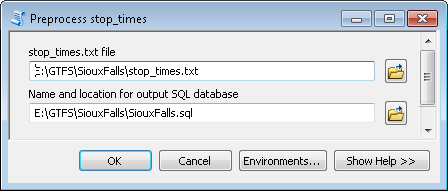
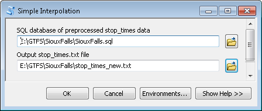

# Interpolate Blank Stop Times User's Guide

Created by Melinda Morang, Esri  
Contact: <mmorang@esri.com>

Copyright 2017 Esri  
Licensed under the Apache License, Version 2.0 (the "License"); you may not use this file except in compliance with the License.  You may obtain a copy of the License at <http://www.apache.org/licenses/LICENSE-2.0>.  Unless required by applicable law or agreed to in writing, software distributed under the License is distributed on an "AS IS" BASIS, WITHOUT WARRANTIES OR CONDITIONS OF ANY KIND, either express or implied.  See the License for the specific language governing permissions and limitations under the License.

## What this tool does
The Interpolate Blank Stop Times toolset is a utility for estimating arrival_time and departure_time values that have been left blank in the stop_times.txt GTFS file.  Values for arrival_time and departure_time are required for certain types of analysis, and you can use this tool to create a new stop_times.txt file with the blank values filled in with estimates.

## Why do I have blank arrival_time and departure_time values?
There are two main reasons why your stop_times.txt file might have no values for arrival_time and departure_time for some stops.

The first reason is that your data was purposefully constructed this way to model time points.  The transit vehicle (typically a bus) reliably arrives at and leaves the time point stop at a specific time.  Other stops in between time points may vary slightly depending on traffic or other conditions, so some transit agencies do not publish exact times for stops that are not time points.  When this is the case, typically all or most trips in your data will be constructed this way.

Blank arrival_time and departure_time values could also be a mistake.  Values for certain stops could have been accidentally left out due to a data processing error.  When this is the case, typically only a small number of stops are affected.

## Why would I want to estimate arrival_time and departure_time values?
Although your dataset may have been intentionally constructed with blank arrival_time and depature_time values to model time points, you may still wish to estimate the arrival and departure times for these stops for analysis purposes.  Some analysis tools, such as [Add GTFS to a Network Dataset](http://www.arcgis.com/home/item.html?id=0fa52a75d9ba4abcad6b88bb6285fae1) and [BetterBusBuffers](http://www.arcgis.com/home/item.html?id=42e57c5ff9a0497f831f4fced087b9b0), require an exact time for each stop.

The stop times estimated by this toolset are not guaranteed to be correct or exact.  You should consider your data and your analysis carefully in order to decide if this estimate is good enough for you.

## Software requirements
- ArcGIS 10.0 or higher with a Desktop Basic (ArcView) license, or ArcGIS Pro

## Data requirements
- A valid GTFS stop_times.txt file

## Getting started
- Download the tool and save it anywhere on your computer.
- Unzip the file you downloaded.  The unzipped package contains a .tbx toolbox file, a folder of python scripts needed to run the toolbox, and a copy of this user's guide.
- No installation is necessary.  You can run the tool from ArcCatalog, ArcMap, or ArcGIS Pro.  In any of those products, just navigate to the folder containing the .tbx file, and it should show up as a toolbox with tools you can run.  You can also add the tool to ArcToolbox to make it easier to find later.
- *Warning: If you wish to move the toolbox to a different location on your computer, make sure you move the entire package (the .tbx file, the scripts folder, and the user's guide) together so that the toolbox does not become disconnected from the scripts.*

## Workflow
1. After preparing the toolbox and your data, run the *Preprocess stop_times* tool. This step performs some analysis of your data and prepares a database that will be used for interpolation later.
2. Run the *Simple Interpolation* Tool to create a new stop_times.txt file with the blank values filled in.

## Running *Preprocess stop_times*

### Inputs
- **stop_times.txt file**:  Your GTFS dataset's stop_times.txt file that includes blank arrival_time and departure_time values
- **Name and location for output SQL database**: The output SQL database that will be used to store, analyze, and interpolate your stop_times.txt data later

### Outputs
- **[Your designated output SQL database file]**: This SQL database simply contains all the data from your stop_times.txt file in a format that is easier to analyze and work with.  You will use this file as input for interpolation later.

## The *Simple Interpolation* tool

### How blank stop times are interpolated
The *Simple Interpolation* tool uses a rudimentary interpolation method to assign arrival_time and departure_time values.  It simply identifies pairs of time points that *do* have times listed, and it assigns evenly spaced times to all stops in between.  This simple method does not consider the distance or drive time between stops.

The arrival_time and departure_time fields are given the same value, as if the transit vehicle spent no time making the stop.

For example, if the trip departs Time Point 1 at 10:00:00 and arrives at Time Point 2 at 10:05:00, and there are four stops in between, the stops will be assigned as follows:
- Non-Timepoint Stop 1: 10:01:00
- Non-Timepoint Stop 2: 10:02:00
- Non-Timepoint Stop 3: 10:03:00
- Non-Timepoint Stop 4: 10:04:00

This method is fairly simplistic, but it should provide a reasonable estimate for transit systems in dense areas with frequent stops and time points that are close together.

### Inputs
- **SQL database of preprocessed stop_times data**:  The SQL database file you created by running the *Preprocess stop_times* tool
- **Output stop_times.txt file**: Your new stop_times.txt file with estimated values for arrival_time and departure_time filled in.  It is recommended to not overwrite your original stop_times.txt file. Save the output with a new file name so you can double check the results before replacing your original file.

### Outputs
- **[Your designated output stop_times.txt file]**: The output stop_times.txt file is identical to your original stop_times.txt file except that all blank arrival_time and departure_time values have been filled in.  A timepoint field will be added if none was previously present, and it will be filled in with values of 0 (meaning that times are considered approximate) for the interpolated times.

### Troubleshooting & potential pitfalls
* The tool takes forever to run: For small stop_times.txt files and for files with only a small number of blank stop times, this tool will run fairly quickly.  However, this tool will take a considerable time to run for very large datasets with a large number of blank times.  It may take many hours to complete.  Progress is reported in  increments of 10%.